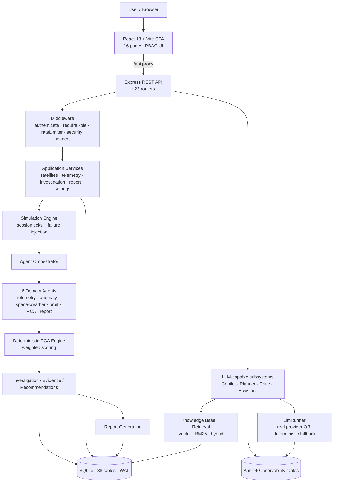
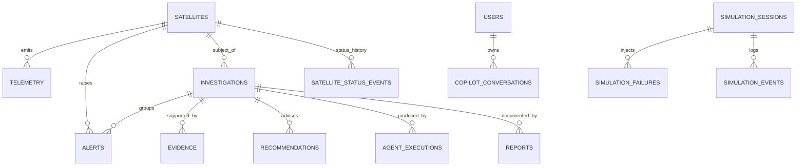
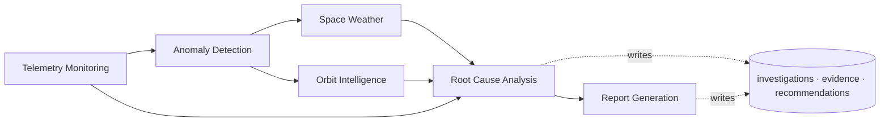
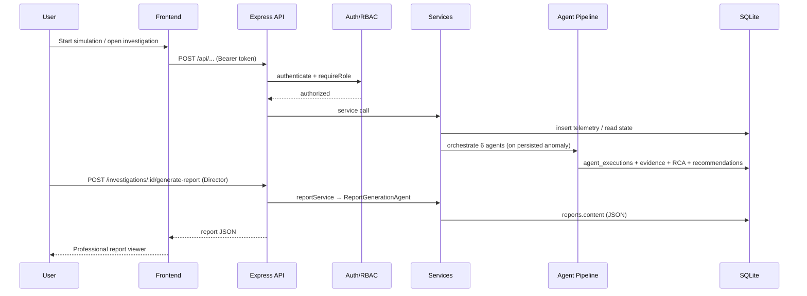
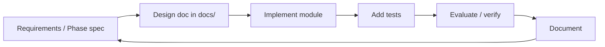
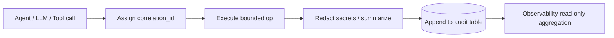
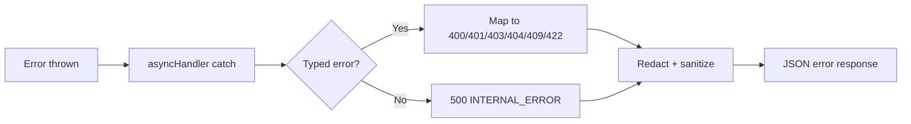
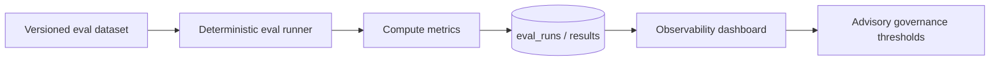

# PROJECT ORION
## Comprehensive Technical Assessment, Testing, Governance, Evaluation, and Quality Report

| Field | Value |
|-------|-------|
| **Project Name** | Project ORION — Multi-Agent Satellite Intelligence & Anomaly Investigation Platform |
| **Project Type** | Simulation & decision-support web platform (full-stack, agentic AI) |
| **Repository Version** | `1.0.0` (backend & frontend `package.json`) |
| **Commit ID** | `96a6fe58685806be23d9a943bc6e98ed5fcc1164` — "Initial commit - Project ORION" (single-commit history) + uncommitted working changes (report redesign) |
| **Assessment Date** | 2026-07-06 |
| **Assessment Scope** | Full repository: frontend, backend, database, auth/RBAC, AI agents, analysis engines, simulation, retrieval/knowledge, audit, evaluation, tests, configuration, documentation |
| **Application Status** | Local development / demonstration — running (backend `127.0.0.1:8000`, frontend `127.0.0.1:5173`) |
| **Analysis Mode** | `OFFLINE_FIXTURE` (default); deterministic engines authoritative; real LLM/embedding providers opt-in and OFF by default |
| **Prepared From** | Direct source-code inspection + executed automated tests, type-checking, and production build during this assessment |
| **Overall Quality Score** | **83 / 100 — Good** |

> **Safety scope statement.** Project ORION is a **simulation and decision-support platform**. It does **not** control real satellites, does **not** send real spacecraft commands, does **not** autonomously execute operational actions, and does **not** communicate with real spacecraft. All satellites, telemetry, and external data are simulated or clearly-labelled offline sample data. All AI outputs and recommendations are advisory and require authorized human review. This scope is enforced in code via `SAFETY_STATEMENT` ([backend/src/config.ts](../backend/src/config.ts)) and read-only tool boundaries.

---

## Executive Summary

**What Project ORION is.** Project ORION is a full-stack platform that simulates a fleet of satellites, ingests their telemetry, detects anomalies, and runs a **six-agent investigation pipeline** that produces a deterministic Root Cause Analysis (RCA), supporting evidence, prioritized advisory recommendations, and a professional investigation report — all under human-in-the-loop review. It layers optional generative-AI capabilities (Mission Copilot, a bounded Planner/Critic reflection loop, and a conversational ORION AI Assistant) on top of a deterministic core, with extensive audit and observability.

**Problem it solves.** Satellite anomaly triage is time-critical, evidence-heavy, and demands explainability and auditability. ORION demonstrates how a multi-agent system can accelerate triage and produce traceable, defensible investigation artifacts **without ever taking autonomous operational control** — the deterministic RCA remains authoritative and every recommendation is advisory.

**Implementation maturity.** The platform is **feature-complete for demonstration and evaluation** and is implemented to a high standard: TypeScript end-to-end (strict mode), a modular backend (22 modules, 6 agents, deterministic analysis engines), a React 18 + Vite frontend with a WebGL 3D orbit visualization, an embedded SQLite database (38 tables), and a comprehensive automated test suite. It is **not production-deployed**: there is no containerization, CI/CD, cloud infrastructure, encryption at rest, or non-default secret management.

**Major capabilities (all IMPLEMENTED unless noted).** Authentication (JWT HS256) + 3-role RBAC; human-controlled satellite simulation with failure injection; deterministic anomaly detection; six-agent investigation orchestration; deterministic weighted-scoring RCA; evidence + recommendation capture; professional report generation with completeness scoring; Mission Copilot (read-only RAG); Planner + Critic bounded agentic analysis; ORION AI Assistant (read-only agentic assistant); AI observability + governance dashboards; provider verification/comparison harness. Real external integrations (NOAA, CelesTrak, OpenAlex) and real LLM/embedding providers are **CONFIGURED BUT NOT ACTIVE** by default — the system runs on offline fixtures and deterministic fallbacks.

**Architecture approach.** A **modular monolith** combining layered architecture (frontend → REST API → middleware → services → data), agent-based orchestration, and event-driven simulation ticks. The backend is loopback-bound for laptop safety; the frontend proxies `/api` to the backend (no CORS in the browser).

**AI/agent capabilities.** Six deterministic domain agents plus four bounded LLM-capable subsystems (Copilot, Planner, Critic, Assistant). Every LLM-capable path is bounded (iteration/tool/time limits), uses a fixed read-only tool allowlist, requires grounding/citations, and degrades to deterministic fallback that is **never** labelled as real-provider output.

**Testing maturity.** Strong at the logic/service/API level: **581 automated tests pass (481 backend across 31 suites + 100 frontend across 13 suites)**, type-checking is clean, and the production build succeeds — all executed during this assessment. Gaps: no frontend component/E2E tests (config restricts to `*.test.ts`, not `.tsx`), no coverage reporting, and no CI automation.

**Security & governance posture.** Solid application-security fundamentals (scrypt password hashing, HS256 JWT, RBAC, login rate-limiting, security headers, secret redaction, provider allowlists, read-only AI tools, simulation-only guardrails, human approval gates). Notable hardening gaps: a built-in **default dev JWT secret** when `ORION_JWT_SECRET` is unset, permissive server-side CORS (`origin: true`), an in-memory rate limiter, and no transport/at-rest encryption.

**Evaluation maturity.** Above typical for a project of this size: deterministic, versioned evaluation datasets for retrieval and for the Assistant; a real-vs-fallback provider comparison harness; and read-only AI observability with advisory governance thresholds. Evaluations are reproducible and never fabricate real-provider results when a provider is unavailable.

**Major limitations.** Not production-ready (no deployment/CI/infra); real integrations and LLM are inactive by default; no encryption at rest; default dev secret; audit trail is AI-execution-centric (no dedicated user-action CRUD audit log); frontend testing is thin; single-commit git history.

**Final quality score: 83 / 100 (Good).** ORION is an exceptionally thorough, well-documented, safety-conscious demonstration platform with a strong deterministic core, genuine agentic depth, and excellent auditability — held back from the 90+ band primarily by production-readiness, deployment/CI, encryption, and frontend/E2E test gaps.

---

# 1. Current Status of the Project

## 1.1 Project Overview
Project ORION is a browser-based mission-intelligence platform. An operator selects a simulated satellite, starts a telemetry simulation session, optionally injects failures, and observes the platform automatically detect anomalies, open an investigation, run a six-agent pipeline, produce a deterministic RCA with evidence and advisory recommendations, and generate a professional investigation report — all gated by human review (approve / reject / resolve). Supplementary AI surfaces (Copilot, Assistant, Planner/Critic) provide read-only, grounded analytical assistance. The stack is TypeScript throughout: an Express backend on Node ≥ 22.5 (using the built-in `node:sqlite`) and a React 18 + Vite frontend.

## 1.2 Problem Statement
Spacecraft anomaly investigation requires rapidly correlating multi-source evidence (telemetry, thresholds, space weather, orbital context), forming a defensible root-cause hypothesis, and producing an auditable record — under strict safety constraints because real satellites must never be commanded by an unproven automated system. ORION addresses the *decision-support* half of this problem: fast, explainable, auditable triage that keeps humans in control.

## 1.3 Project Objectives
- Demonstrate a **multi-agent** anomaly-investigation pipeline with deterministic, reproducible outputs.
- Keep the platform **simulation-only and advisory-only** (no real commanding, no autonomy).
- Provide **explainability and auditability** (scoring breakdowns, evidence, correlation IDs, audit tables).
- Layer **optional generative AI** without compromising the deterministic authority or safety guardrails.
- Provide **evaluation and observability** for the AI subsystems.

## 1.4 Current Application Status

| Component | Status | Implementation Evidence | Limitations | Recommendation |
|-----------|--------|-------------------------|-------------|----------------|
| Frontend | IMPLEMENTED | React 18 + Vite; 16 pages, ~34 components ([frontend/src/App.tsx](../frontend/src/App.tsx)) | No component/E2E tests; polling not push | Add component/E2E tests |
| Backend | IMPLEMENTED | Express 4 modular monolith, 22 modules ([backend/src/app.ts](../backend/src/app.ts)) | Monolithic; in-memory rate limiter | Externalize rate-limit store |
| Database | IMPLEMENTED | `node:sqlite`, 38 tables, WAL, transactions ([backend/src/db.ts](../backend/src/db.ts)) | Single-file SQLite; no migrations framework | Add migration tooling for prod |
| Authentication | IMPLEMENTED | JWT HS256 + scrypt ([backend/src/auth/](../backend/src/auth/)) | Default dev secret if unset | Require secret in prod; rotate |
| RBAC | IMPLEMENTED | `requireRole` + route matrix; frontend `canAccess` | — | Add automated RBAC matrix test at scale |
| Simulation | IMPLEMENTED (SIMULATED by design) | Session-based engine ([backend/src/services/simulationService.ts](../backend/src/services/simulationService.ts)) | Deterministic sim only (intended) | — |
| Telemetry | IMPLEMENTED | `telemetry` table + `telemetryService.ts` | Simulated source only | — |
| Anomaly detection | IMPLEMENTED | Deterministic rules ([backend/src/analysis/anomalyRules.ts](../backend/src/analysis/anomalyRules.ts)) | Fixed rule set | — |
| Alert generation | IMPLEMENTED | `anomalyService.ts` (dedup + cooldown) | — | — |
| Investigation | IMPLEMENTED | Lifecycle + transitions ([backend/src/services/investigationService.ts](../backend/src/services/investigationService.ts)) | — | — |
| Root Cause Analysis | IMPLEMENTED | Deterministic weighted scoring ([backend/src/analysis/rootCauseEngine.ts](../backend/src/analysis/rootCauseEngine.ts)) | Rule/weight-based (not learned) | — |
| AI agents (6) | IMPLEMENTED | [backend/src/agents/](../backend/src/agents/) | Two adapters use offline fixtures | — |
| Mission Copilot | IMPLEMENTED (OFFLINE FALLBACK default) | [backend/src/copilot/](../backend/src/copilot/) | Deterministic unless LLM configured | Enable real provider to exercise |
| Planner / Critic | IMPLEMENTED (OFFLINE FALLBACK default) | [backend/src/planner/](../backend/src/planner/), [backend/src/critic/](../backend/src/critic/) | Deterministic unless LLM configured | — |
| ORION AI Assistant | IMPLEMENTED (OFFLINE FALLBACK default) | [backend/src/assistant/](../backend/src/assistant/) | Deterministic unless LLM configured | — |
| Reporting | IMPLEMENTED (v2 redesign) | [backend/src/agents/reportGenerationAgent.ts](../backend/src/agents/reportGenerationAgent.ts), [frontend/src/pages/ReportDetailsPage.tsx](../frontend/src/pages/ReportDetailsPage.tsx) | Pre-v2 stored reports show partial data | Regenerate legacy reports |
| Audit trail | PARTIALLY IMPLEMENTED | AI-execution audit tables + `agent_executions` + `*_events` | No dedicated user-CRUD audit log | Add user-action audit log |
| Evaluation | IMPLEMENTED | Retrieval eval, assistant eval, provider comparison | Real-provider arms inactive by default | — |
| Testing | IMPLEMENTED (backend/logic strong) | 581 passing tests | No FE component/E2E, no coverage/CI | Add coverage + CI |
| External integrations (NOAA/CelesTrak/OpenAlex) | CONFIGURED BUT NOT ACTIVE / OFFLINE FALLBACK | [backend/src/integrations/fixtures/](../backend/src/integrations/) | Offline fixtures only | Wire live mode when authorized |
| Deployment/CI/CD | NOT IMPLEMENTED | No Dockerfile/compose/workflows found | Local only | Containerize + CI/CD |

## 1.5 Implemented Functional Modules
- **Mission dashboard** — fleet KPIs, live orbit map, telemetry stream, insights, alerts, quick actions.
- **Satellite management** — dynamic onboarding, lifecycle (active/archive/reactivate), manual status override with audit.
- **Simulation control center** — session create/start/pause/resume/stop, telemetry-profile tuning, failure injection.
- **Anomaly → alert → investigation → RCA → report** pipeline (six agents).
- **Reports** — v2 professional report viewer + generator with deterministic completeness scoring.
- **AI surfaces** — Copilot, Assistant, Planner, Critic (all read-only, bounded).
- **Knowledge base + retrieval** — ingestion, chunking, vector/BM25/hybrid retrieval, retrieval evaluation.
- **Observability & governance** — read-only AI metrics with advisory thresholds.
- **Providers** — verification, embedding-space management, real-vs-fallback comparison.

## 1.6 Current Limitations
- No production deployment, containerization, or CI/CD.
- Real integrations + real LLM/embedding providers inactive by default (offline fixtures / deterministic fallbacks).
- Default dev JWT secret when unset; permissive server CORS; in-memory rate limiter.
- No encryption in transit (HTTP loopback) or at rest (plain SQLite file).
- Audit trail is AI-execution-centric; no dedicated user-action CRUD audit log.
- Frontend testing limited to pure logic modules (`.test.ts`), not React components.
- Single-commit git history (limited change traceability).

## 1.7 Project Readiness Assessment
- **Development readiness: HIGH** — clean structure, strict typing, passing tests, hot-reload dev servers.
- **Demonstration readiness: HIGH** — feature-complete offline demo with a scripted `EVALUATION_DEMO.md`.
- **Testing readiness: MEDIUM-HIGH** — strong backend/logic coverage; frontend/E2E gaps; no CI.
- **Production readiness: LOW** — no deployment/CI/infra, no encryption, default secret, single-node SQLite. **Not production-ready.**

---

# 2. Project Architecture

## 2.1 Architecture Overview
Project ORION is a **modular monolith** exhibiting: **layered architecture** (presentation → API → middleware → service → data), **agent-based orchestration** (six domain agents + bounded LLM agents), **event-driven processing** (simulation ticks trigger detection → investigation), and **REST** (JSON over HTTP). These patterns are all supported by the code; there is no microservice split, message broker, or event bus beyond the in-process simulation loop.

## 2.2 High-Level Architecture Diagram

## 2.3 Frontend Architecture
- **Framework:** React 18.3.1 + TypeScript 5.7 (strict), Vite 5.4, Tailwind 3.4.
- **Structure:** `src/pages` (16 route pages), `src/components` (UI primitives in `ui.tsx`, domain components, `assistant/` suite of 9, `orbit3d/` suite of ~13), `src/hooks` (`usePolling`), `src/api/client.ts`, `src/auth`, `src/lib` (pure logic + tests).
- **Routing:** `react-router-dom` v6; a `ProtectedRoute` guards all authenticated routes; catch-all redirects to `/`.
- **State management:** No global store; server state via `usePolling(fn, intervalMs, deps)` (initial load spinner, silent 3s refresh, manual `refetch`). Auth state via `AuthContext`.
- **API communication:** Same-origin `/api` (Vite proxy → `127.0.0.1:8000`); bearer token injected per request; global `401` handler triggers logout.
- **Authentication handling:** Token stored in localStorage (remember) or sessionStorage; session restored via `/auth/me`.
- **Role-based UI:** `permissions.ts` `canAccess(role, path)` + `ROUTE_ROLES` matrix; menu and routes gated by role.
- **Charts:** `recharts` (`TelemetryChart`, `SatelliteHealthDonut`). **Maps/3D:** WebGL Earth globe (`orbit3d/` via `three` + `@react-three/fiber` + `drei`). **Report viewer:** `ReportDetailsPage.tsx` (v2). **AI assistant UI:** `assistant/` component suite with execution timeline, source drawer, feedback.

## 2.4 Backend Architecture
- **Runtime/language:** Node ≥ 22.5, TypeScript (ESM, `tsx` in dev, `tsc` build).
- **Framework:** Express 4.
- **Entry:** [backend/src/index.ts](../backend/src/index.ts) → `buildApp()`/`initOrion()` in [backend/src/app.ts](../backend/src/app.ts) (schema init, simulation init, user + knowledge seeding), binds `127.0.0.1:8000`.
- **Routes:** ~23 routers under `/api/*` (see Appendix D).
- **Controllers:** Thin route handlers wrapped in `asyncHandler`; no separate controller layer.
- **Services:** 11 service modules in `backend/src/services/` (satellite, telemetry, anomaly, investigation, report, reportComposer, settings, simulation, simulationFailures, satelliteStatus, llmAudit).
- **Middleware:** `authenticate`, `requireRole`, `rateLimiter` ([backend/src/auth/middleware.ts](../backend/src/auth/middleware.ts)) + security-headers + centralized `errorHandler`.
- **Data access:** Direct parameterized SQL via the `db` facade (`db.ts`); helpers `now()`, `transaction()`, `addColumnIfMissing()`.
- **AI agents / analysis / simulation / report / evaluation engines:** as inventoried in §2.6 and Appendix E.

## 2.5 Database Architecture
- **Technology:** `node:sqlite` (Node built-in) — no native compilation; `PRAGMA journal_mode = WAL`, `PRAGMA foreign_keys = ON`.
- **Initialization:** `initSchema()` creates all tables idempotently on startup; `:memory:` used for tests.
- **Tables:** 38 total — core mission (`satellites`, `telemetry`, `alerts`, `investigations`, `evidence`, `recommendations`, `agent_executions`, `reports`), auth/settings (`users`, `system_settings`), knowledge (`knowledge_documents`, `knowledge_chunks`), and AI-audit/eval tables across Phases 1–10 (LLM, retrieval, generation, copilot, planner, critic, provider, assistant) plus simulation (`simulation_sessions`, `simulation_failures`, `simulation_events`, `satellite_status_events`).
- **Persistence flow:** simulation tick → `telemetry` insert → anomaly rule eval → `alerts` → `investigations` → agent runs recorded in `agent_executions` → RCA writes `investigations` + `evidence` + `recommendations` → `reports`.
- **Seed data:** three demo users; knowledge base seeded if empty; six seed satellites.
- **Lifecycle:** history is append-only in practice (telemetry/alerts/investigations not auto-deleted; removed/expired sim failures retained). **Limitations:** single-file SQLite, no formal migration framework, no at-rest encryption.

### Entity-Relationship (core mission subset)

## 2.6 AI Agent Architecture
All six agents extend `BaseAgent` ([backend/src/agents/base.ts](../backend/src/agents/base.ts)), which times each run, records it in `agent_executions` (status, timing, input/output summaries, error message), and supports `FALLBACK_USED`. Failures are caught and recorded as `FAILED` with `output: null`.

| Agent | Purpose | Input | Processing | Output | Fallback |
|-------|---------|-------|-----------|--------|----------|
| Telemetry Monitoring (`telemetry-monitoring`) | Trend + health scoring | Recent samples, thresholds, baseline altitude | Trends, health score, threshold violations | `TelemetryObservation` | Deterministic (no external dep) |
| Anomaly Detection (`anomaly-detection`) | Classify + severity | `TelemetryObservation` | Persistence-checked rule classification | `AnomalyDetectionResult` | Deterministic |
| Space Weather (`space-weather`) | Space-weather context | Satellite id | NOAA fixture lookup, relevance | `SpaceWeatherEvidence` | OFFLINE FALLBACK (fixture); `fallback_used` flag |
| Orbit Intelligence (`orbit-intelligence`) | Orbital/TLE context | Satellite id, altitudes | CelesTrak fixture lookup, deviation | `OrbitEvidence` | OFFLINE FALLBACK (fixture) |
| Root Cause Analysis (`root-cause-analysis`) | Determine root cause | Evidence bundle | Deterministic weighted scoring | `RootCauseAnalysisResult` (confidence clamped 0.5–0.97) | Deterministic |
| Report Generation (`report-generation`) | Structured report | Investigation + satellite + evidence + recs + executions + telemetry + thresholds | Composes structured sections + completeness score | `InvestigationReport` | OpenAlex fixture; `fallback_used` flag |

## 2.7 Request and Data Flow

---

# 3. Project Infrastructure

## 3.1 Development Infrastructure
- **OS environment:** Windows 11 (developed on a company laptop; loopback-only binding for safety).
- **Frontend runtime:** Node + Vite dev server. **Backend runtime:** Node ≥ 22.5 via `tsx watch`.
- **Database:** embedded `node:sqlite` (`backend/data/orion.db`).
- **Package manager:** npm (per-package `package-lock.json`). **Build tools:** `tsc`, Vite. **Source control:** Git (single commit).

## 3.2 Runtime Infrastructure
Frontend (`5173`) serves the SPA and proxies `/api` to the backend (`8000`); the backend owns the SQLite file and runs the in-process simulation loop. No external services are contacted in default (`OFFLINE_FIXTURE`) mode.

## 3.3 Network Architecture
- **Frontend port:** `127.0.0.1:5173`. **Backend port:** `127.0.0.1:8000`.
- **API base URL:** same-origin `/api` (browser) → Vite proxy → `http://127.0.0.1:8000`.
- **CORS:** backend uses `cors({ origin: true })` (permissive server-side; browser avoids CORS via same-origin proxy).
- **WebSocket:** none — the Assistant uses HTTP SSE streaming; other data uses polling.
- **External connections:** none active by default (offline fixtures).

## 3.4 Environment Configuration
Configuration is via `ORION_*` environment variables documented in [.env.example](../.env.example) (see Appendix H for the full name/purpose reference). All have safe offline defaults; secrets (`ORION_LLM_API_KEY`, `ORION_EMBEDDING_API_KEY`, `ORION_JWT_SECRET`) are read from the environment only and never logged, persisted, or returned by APIs. **No secret values are exposed in this document.**

## 3.5 External Integrations
| Integration | Real Status | Default Behavior |
|-------------|-------------|------------------|
| NOAA SWPC (space weather) | CONFIGURED BUT NOT ACTIVE | OFFLINE FIXTURE |
| CelesTrak (orbit/TLE) | CONFIGURED BUT NOT ACTIVE | OFFLINE FIXTURE |
| OpenAlex (references) | CONFIGURED BUT NOT ACTIVE | OFFLINE FIXTURE |
| LLM provider (OpenAI/Anthropic/Azure/HTTP) | CONFIGURED BUT NOT ACTIVE | DETERMINISTIC FALLBACK |
| Embedding provider | CONFIGURED BUT NOT ACTIVE | LOCAL HASH FALLBACK |

## 3.6 Deployment Status
**Local development only.** No Dockerfile, docker-compose, `.github/workflows`, Procfile, nginx, or cloud config exist in the repository. Not containerized, no CI/CD, not cloud- or production-deployed.

## 3.7 Infrastructure Limitations
No horizontal scaling (single-node SQLite, in-memory rate limiter), no reverse proxy/TLS, no secret manager, no observability/log aggregation stack, no backup/restore automation.

## 3.8 Recommended Production Infrastructure
Containerize (Docker) both services; add CI/CD (GitHub Actions) running lint/typecheck/tests/build; front with a TLS-terminating reverse proxy; move to a networked RDBMS or managed SQLite with backups; externalize rate-limiting (Redis); integrate a secret manager; add structured logging + metrics + tracing export.

---

# 4. Development Model / Methodology

## 4.1 Development Approach
Evidence indicates an **incremental, phase-based (feature-by-feature) development model** — the codebase and 56 markdown docs are organized around numbered phases (Phase 1 LLM foundation → Phase 10 AI Assistant), each self-contained and additive with safe offline defaults.

## 4.2 Requirements Analysis
Captured in `README.md`, `PROJECT_NOTES.md` (problem statement + 50+ evaluator Q&A), and per-phase architecture docs in `docs/`.

## 4.3 System Design
Documented before/with implementation — `docs/` contains architecture baselines and security-boundary documents for each subsystem.

## 4.4 Incremental Module Development
Each phase adds a bounded module (copilot, planner, critic, assistant, observability, providers) without breaking earlier ones (verified by the full passing test suite).

## 4.5 Frontend Development
Page-and-component driven; reusable primitives in `ui.tsx`; incremental UI features (3D globe, report viewer, assistant suite) added over time.

## 4.6 Backend Development
Service-oriented modular monolith; new API routers mounted additively; deterministic engines first, LLM layered on top.

## 4.7 AI Agent Development
Deterministic domain agents first (`BaseAgent` contract), then bounded LLM-capable subsystems with allowlists and fallbacks.

## 4.8 Integration
External adapters abstracted behind an integration layer with offline fixtures; LLM/embedding behind provider abstractions.

## 4.9 Testing
Test-alongside development: 31 backend + 13 frontend suites covering rules, RCA, agents, auth, API, simulation, retrieval, evaluation.

## 4.10 Evaluation
Versioned deterministic evaluation datasets and a provider-comparison harness are part of the codebase.

## 4.11 Documentation
Extensive: 56 markdown files (README + demo + notes + 53 `docs/`).

## 4.12 Source Control and Version Management
Git repository present but **single commit** ("Initial commit - Project ORION"); no branch/PR history is available in the repo. Working-tree changes for the report redesign are currently uncommitted.

## 4.13 Why This Methodology Fits Project ORION
An incremental, safety-first, offline-default model suits a decision-support platform where each AI capability must be provably bounded and non-destructive before the next is layered on.

## 4.14 Development Lifecycle Diagram

> No evidence of Scrum ceremonies, sprint cadences, or multi-developer team rituals is present; only the artifacts above are claimed.

---

# 5. Testing Performed

Test categories supported by evidence (backend `tests/**/*.test.ts`, frontend `src/**/*.test.ts`):

- **Unit testing** — pure logic (anomaly rules, RCA scoring, report composer, formatters, orbit math). Framework: Vitest. Result: PASS.
- **Integration / API testing** — router-level tests (auth, briefing, copilot, critic, planner, observability, llm, knowledge, providers) exercising the Express app against an in-memory DB. Result: PASS.
- **Authentication testing** — `auth.test.ts` (backend + frontend). Result: PASS.
- **Authorization / RBAC testing** — role gating validated within API tests and frontend `canAccess`. Result: PASS.
- **Anomaly detection testing** — `anomalyRules.test.ts`. Result: PASS.
- **RCA / agent testing** — `rootCause`, agent orchestration in `demoFlow.test.ts`. Result: PASS.
- **Simulation testing** — session lifecycle + failure injection. Result: PASS.
- **Evaluation testing** — retrieval/assistant evaluation paths. Result: PASS.
- **Report testing** — `reportComposer.test.ts` (backend), `reportModel.test.ts` (frontend). Result: PASS.
- **Type checking** — `tsc --noEmit` (frontend) / `tsc -p` (backend). Result: CLEAN.
- **Build verification** — `npm run build` (frontend). Result: SUCCESS.

For each category the **objective** is correctness/regression protection; **tools** are Vitest (+ jsdom for frontend); **methodology** is deterministic assertions against fixed inputs and an in-memory DB. **Not present:** frontend React-component tests (config restricts to `*.test.ts`), end-to-end/browser tests, load/performance tests, coverage reporting.

---

# 6. Formal Testing Report

## 6.1 Testing Scope
Backend service/logic/API layers and frontend pure-logic modules, plus type-checking and production build. GPU/browser-rendered UI and PDF output were **not** verified visually (no browser-automation tooling in the environment).

## 6.2 Test Environment
Vitest 2.x; backend `environment: node` with `ORION_DB_FILE=:memory:` and `OFFLINE_FIXTURE`; frontend `environment: jsdom` with a `MemStorage` polyfill. Executed during this assessment on the development machine.

## 6.3 Test Strategy
Deterministic unit + integration tests with in-memory isolation; type-checking; production build as an integration gate. No mocking of the deterministic core (real engines under test).

## 6.4 Test Execution Summary (executed during this assessment)

| Test Suite | Test Type | Total | Passed | Failed | Skipped | Pass Rate | Status |
|------------|-----------|-------|--------|--------|---------|-----------|--------|
| Backend (`backend/tests`) | Unit + Integration + API | 481 | 481 | 0 | 0 | 100% | PASS |
| Frontend (`frontend/src`) | Unit (logic) | 100 | 100 | 0 | 0 | 100% | PASS |
| **Combined** | | **581** | **581** | **0** | **0** | **100%** | **PASS** |
| Frontend typecheck (`tsc --noEmit`) | Static | — | — | 0 | — | — | CLEAN |
| Backend typecheck (`tsc -p`) | Static | — | — | 0 | — | — | CLEAN |
| Frontend build (`npm run build`) | Build | — | — | 0 | — | — | SUCCESS |

Backend suites: 31 files. Frontend suites: 13 files.

## 6.5 Detailed Test Cases (representative)

| Test ID | Module | Scenario | Expected | Actual | Status |
|---------|--------|----------|----------|--------|--------|
| TC-01 | anomalyRules | Battery below threshold for ≥3 samples | LOW_BATTERY violation | Violation raised | PASS |
| TC-02 | rootCauseEngine | Power + battery anomalies | Ranked root cause, confidence ≤ 0.97 | Correct ranking | PASS |
| TC-03 | reportComposer | Critical telemetry snapshot | CRITICAL metric statuses | Correct statuses | PASS |
| TC-04 | reportComposer | Completeness scoring | Score 0–100, categories sum 100 | 100/100 for full data | PASS |
| TC-05 | auth (backend) | Login with valid/invalid creds | 200 / 401 | Correct | PASS |
| TC-06 | RBAC | Analyst hits Director-only route | 403 | Forbidden | PASS |
| TC-07 | reportModel (FE) | Legacy report derivation | No fabrication, "Not Available" | Correct | PASS |
| TC-08 | demoFlow | End-to-end sim → RCA → report | Pipeline completes; STOP non-destructive | Completes | PASS |

## 6.6 Defects Identified

| Defect ID | Description | Severity | Status | Resolution |
|-----------|-------------|----------|--------|------------|
| — | No functional defects identified during this assessment (all suites pass, typecheck clean, build succeeds) | — | — | — |

## 6.7 Test Coverage and Gaps
Strong coverage of deterministic logic, services, API contracts, auth/RBAC, simulation, and evaluation. **Gaps:** no frontend component/E2E tests, no coverage instrumentation/thresholds, no CI enforcement, no performance/load tests, no visual/PDF verification.

## 6.8 Testing Conclusion
The automated test posture is **strong for a project of this scope** and gives high confidence in backend correctness and regression safety. Frontend behavioral testing and CI are the primary maturation targets.

---

# 7. Audit Trail Mechanism

## 7.1 Purpose
Provide traceability and explainability for AI executions and mission-state transitions.

## 7.2 Audit Architecture
Append-only audit tables written by services/agents, keyed by correlation IDs and linked to investigations/conversations.

## 7.3 Audit Data Captured
- **Agent runs:** `agent_executions` (agent, status, timing, summaries, error).
- **LLM calls:** `llm_executions` (provider, model, mode, tokens, latency, validation, sanitized error).
- **Retrieval/generation:** `retrieval_executions`, `grounded_generation_executions`.
- **AI subsystems:** `copilot_executions`/`copilot_tool_executions`, `planner_executions`/steps/refinements, `critic_executions`/issues/revisions, `assistant_executions`.
- **Providers:** verification/reindex/comparison tables.
- **Mission events:** `simulation_events`, `satellite_status_events`, investigation lifecycle timestamps.

## 7.4 Audit Event Flow

## 7.5 User Actions Audited
PARTIALLY IMPLEMENTED — user-driven **mission** actions surface indirectly (investigation `reviewed_at`/`review_decision`, `satellite_status_events.actor/actor_role`, `simulation_events.actor`), but there is **no dedicated generic user-action/CRUD audit log**.

## 7.6 System Actions Audited
IMPLEMENTED — simulation ticks/failures, status resolution, investigation transitions.

## 7.7 AI Agent Actions Audited
IMPLEMENTED (comprehensive) — every agent/LLM/tool/planner/critic/assistant execution is recorded.

## 7.8 Correlation / Trace IDs
IMPLEMENTED — UUID `correlation_id` per AI execution; investigation id as the mission trace root linking agents, evidence, RCA, and reports.

## 7.9 Audit Storage
SQLite tables (same DB), bounded row reads for observability.

## 7.10 Audit Retrieval
Read-only, RBAC-gated endpoints (`/api/llm`, `/api/planner`, `/api/critic`, `/api/observability`, etc.) restricted to Director/Admin.

## 7.11 Audit Security
Secrets redacted before persistence (`redactSecrets`), sanitized error messages, parameterized SQL, role-gated retrieval.

## 7.12 Current Limitations
No dedicated user-CRUD audit log; audit lives in the application DB (no tamper-evident/WORM store); no export/retention policy.

## 7.13 Recommended Improvements
Add a first-class `user_actions` audit log (actor, action, resource, result, request id) at the middleware layer; ship audit to append-only external storage; add retention + export.

---

# 8. Error Handling Methodology

## 8.1 Strategy
Centralized, typed-error → HTTP-status mapping with secret-safe messages; async errors funneled via `asyncHandler`.

## 8.2 Backend Error Handling
[backend/src/api/errors.ts](../backend/src/api/errors.ts): `asyncHandler` wraps handlers; `errorHandler` is the last middleware.

## 8.3 API Error Responses
Consistent JSON `{ error: CODE, message, details? }`.

## 8.4 Validation Errors
`*ValidationError` → `400 BAD_REQUEST` (with `details`).

## 8.5 Authentication Errors
Missing/invalid/expired token → `401 UNAUTHORIZED`.

## 8.6 Authorization Errors
Insufficient role → `403 FORBIDDEN`.

## 8.7 Database Errors
Wrapped by service-level typed errors (not-found/conflict/invalid-transition) → 404/409; unexpected → `500 INTERNAL_ERROR` (stack never leaked).

## 8.8 Agent Execution Errors
Caught in `BaseAgent`, recorded as `FAILED` with `error_message`; pipeline degrades gracefully.

## 8.9 External LLM Provider Errors
`ProviderError` (stable, sanitized codes) → retry (bounded, backoff) → deterministic fallback (`REAL_PROVIDER_ERROR:{code}`), never labelled real.

## 8.10 Timeout Handling
Per-call and per-subsystem timeouts (LLM `timeoutMs`; copilot/planner/critic/assistant `maxExecutionMs`, tool timeouts).

## 8.11 Fallback Handling
Deterministic fallbacks everywhere real AI is optional; offline fixtures for external adapters.

## 8.12 Frontend Error Handling
`ApiError` thrown on non-2xx; `ErrorState`/`LoadingState`/`EmptyState` components; global `401` → logout; a 3D error boundary guards the WebGL globe.

## 8.13 Logging
Console logging for unhandled errors (`[ORION] Unhandled error: …`); no structured/centralized logging stack.

## 8.14 Secret-Safe Error Reporting
`redactSecrets()` strips API keys, bearer tokens, and common key shapes before logs/audit/responses.

## 8.15 Limitations
No structured/correlated request logging; limited client-side retry/telemetry.

## 8.16 Recommended Improvements
Adopt structured logging with request/correlation IDs; add error monitoring; standardize client retry/backoff.

---

# 9. Guardrails

| Guardrail | Purpose | Implementation | Enforcement Point | Status | Limitation |
|-----------|---------|----------------|-------------------|--------|------------|
| Authentication | Identity | JWT HS256 | `authenticate` middleware | IMPLEMENTED | Default dev secret if unset |
| RBAC | Least privilege | `requireRole` + matrix | API + FE `canAccess` | IMPLEMENTED | — |
| Input validation | Reject bad input | Service validators | Service layer | IMPLEMENTED | Not schema-centralized |
| Request size limits | Abuse control | Message char caps (copilot/assistant) | AI services | PARTIAL | No global body-size cap tuned |
| Rate limiting | Brute-force defense | `rateLimiter(10,60s)` on login | Middleware | IMPLEMENTED | In-memory only |
| Read-only AI tools | Prevent mutation | Fixed 8-tool allowlist | Tool registry | IMPLEMENTED | — |
| Advisory-only recs | No autonomy | Labels + disclaimers | Agents/services | IMPLEMENTED | — |
| Deterministic RCA authority | Trust anchor | RCA never overridden by LLM | Planner/Critic/Assistant | IMPLEMENTED | — |
| Evidence grounding | Truthful AI | Grounding validators | Generation/assistant | IMPLEMENTED | Active mainly with real provider |
| Citation requirement | Traceability | Citation validators | Generation/planner | IMPLEMENTED | — |
| Tool/provider allowlists | Restrict surface | LLM/embedding allowlists | Config | IMPLEMENTED | — |
| Simulation-only boundary | Safety | No real command paths; `SAFETY_STATEMENT` | Whole system | IMPLEMENTED | — |
| Human approval | Human-in-loop | Approve/reject/resolve gates | Investigation API | IMPLEMENTED | — |
| Secret protection | No leakage | `redactSecrets`, env-only secrets | Config/audit/logs | IMPLEMENTED | — |
| Output validation | Schema safety | Structured-output validators + fallback | LlmRunner | IMPLEMENTED | — |
| HTTPS endpoint policy | Transport trust | `isTrustedEndpoint` (HTTPS non-loopback) | Provider config | IMPLEMENTED | App itself served over HTTP loopback |

**9.1 Application guardrails** — auth, RBAC, validation, rate-limit. **9.2 Security guardrails** — allowlists, HTTPS endpoint policy, secret redaction, security headers. **9.3 AI guardrails** — read-only tools, bounded loops, grounding/citations, deterministic authority, fallback labelling. **9.4 Operational-safety guardrails** — simulation-only, loopback binding, non-destructive stop. **9.5 Human-in-the-loop** — investigation review gates, human-review-required flags in Critic. **9.6 Limitations** — default secret, permissive CORS, in-memory rate limiter, HTTP transport. **9.7 Recommendations** — require prod secret, restrict CORS to known origins, externalize rate-limit, add TLS.

---

# 10. Privacy-Preserving Mechanisms

> **No regulatory compliance (GDPR, DPDP, CCPA, HIPAA, ISO 27001, SOC 2) is claimed or demonstrated.** ORION is an offline simulation with minimal personal data.

## 10.1 Privacy Requirements
Minimal — the system stores demo user accounts and simulated mission data only.

## 10.2 Data Collected
Usernames, roles, display names, scrypt password hashes; simulated telemetry/investigations; AI conversation content (user-authored).

## 10.3 Personal Data Assessment
Only account identifiers (usernames/display names) qualify as personal data; no end-user PII, biometrics, or financial data.

## 10.4 Data Minimization
Only fields needed for auth and mission simulation are stored.

## 10.5 Purpose Limitation
Data used solely for authentication, RBAC, and mission-simulation features.

## 10.6 Authentication Data Protection
Passwords stored as salted scrypt hashes (`salt:key`), never plaintext; constant-time verification.

## 10.7 Secret Management
Secrets from environment only; `redactSecrets()` prevents leakage into logs/audit/responses.

## 10.8 Logging & Privacy
Console logging only; sensitive values redacted; no payloads persisted unless explicitly opted in (sanitized/truncated).

## 10.9 Audit Data Privacy
Audit stores summaries/sanitized errors, not raw secrets.

## 10.10 AI Provider Data Exposure
In default mode, **no data leaves the machine** (deterministic fallback / local embeddings). If a real provider is configured, prompt context would be sent to that provider (operator responsibility).

## 10.11 Data Retention
No formal retention policy; mission history is append-only.

## 10.12 Data Deletion
No user-facing deletion/erasure workflow.

## 10.13 Encryption in Transit
NOT IMPLEMENTED — HTTP over loopback in dev (mitigated by local-only binding).

## 10.14 Encryption at Rest
NOT IMPLEMENTED — plain SQLite file.

## 10.15 Access Control
RBAC restricts sensitive/audit endpoints to Director/Admin.

## 10.16 Privacy-by-Design Assessment
Good defaults (offline, minimal data, secret redaction); missing formal retention/deletion and encryption.

## 10.17 Current Privacy Gaps
No at-rest/in-transit encryption; no retention/deletion; demo credentials.

## 10.18 Recommendations for International Deployment
Add TLS + at-rest encryption; define retention/deletion; formal DPIA before handling real personal data; document provider data-flow if real LLM enabled.

| Privacy Control | Status | Evidence | Risk | Recommendation |
|-----------------|--------|----------|------|----------------|
| Password hashing | IMPLEMENTED | `auth/passwords.ts` (scrypt) | Low | Keep; add pepper |
| Secret redaction | IMPLEMENTED | `config.redactSecrets` | Low | Keep |
| Data minimization | IMPLEMENTED | schema | Low | Keep |
| Encryption in transit | NOT IMPLEMENTED | HTTP loopback | Medium (prod) | Add TLS |
| Encryption at rest | NOT IMPLEMENTED | plain `.db` | Medium (prod) | Encrypt volume/DB |
| Retention/deletion | NOT IMPLEMENTED | none | Medium (prod) | Define policy |
| Provider data egress | OFFLINE by default | `llm.provider='none'` | Low (default) | Document if enabled |

---

# 11. System Evaluation

## 11.1 Objectives
Measure AI-subsystem quality (retrieval, generation, assistant, real-vs-fallback) deterministically and reproducibly.

## 11.2 Architecture
Read-only observability repository over allowlisted audit tables + dedicated evaluation runners writing `*_eval_runs`/`*_results` and comparison tables.

## 11.3 Metrics
Retrieval: precision@k, recall@k, MRR, hit-rate@k, nDCG@k. Assistant: intent/context/tool-selection accuracy, grounding-accepted rate, refusal-correct rate, real-accepted/fallback/failure rates, latency p50/p95. Comparison: grounding-valid rate, citation/evidence/policy validity, fallback occurrence, latency.

## 11.4 Agent Evaluation
Agents validated via deterministic pipeline tests (`demoFlow`, `rootCause`).

## 11.5 Anomaly Detection Evaluation
`anomalyRules.test.ts` verifies rule/severity determinism.

## 11.6 RCA Evaluation
Deterministic scoring verified; confidence clamped 0.5–0.97.

## 11.7 Evidence Grounding Evaluation
Grounding/citation validators in generation/assistant paths; observed via audit + evaluation runs.

## 11.8 Report Evaluation
Deterministic completeness scoring (0–100) verified by tests.

## 11.9 Guardrail Evaluation
Assistant eval includes prompt-injection refusal and insufficient-evidence rejection scenarios.

## 11.10 Security Evaluation
Auth/RBAC tests; documented security-boundary audits in `docs/`.

## 11.11 Privacy Evaluation
Offline-by-default posture; secret-redaction verified indirectly via audit/no-leak checks.

## 11.12 Reliability Evaluation
Fallback determinism ensures graceful degradation; full suite green.

## 11.13 Performance Evaluation
Latency captured in audit/eval (p50/p95) for AI paths; no dedicated load test.

## 11.14 Evaluation Workflow

---

# 12. Formal Evaluation Report

| Evaluation Category | Metric | Score / Result | Weight | Weighted | Status | Evidence |
|---------------------|--------|----------------|--------|----------|--------|----------|
| Retrieval quality | precision/recall/MRR/nDCG@k | Framework present; deterministic dataset | 0.20 | — | IMPLEMENTED | `retrieval_evaluation_runs`, `knowledgeHybridApi.test.ts` |
| Assistant behavior | intent/context/tool/refusal accuracy | 13-scenario deterministic dataset (`orion-assistant-eval-v1`) | 0.25 | — | IMPLEMENTED | `assistantCorrectness.test.ts`, `assistant_eval_*` |
| Real-vs-fallback | grounding/citation/policy validity, latency | Harness present; real arm degrades to fallback when provider absent | 0.20 | — | IMPLEMENTED (real arm inactive by default) | `provider_comparison_*` |
| Anomaly/RCA determinism | rule + scoring correctness | All tests pass | 0.20 | — | IMPLEMENTED | `anomalyRules.test.ts`, `rootCause.test.ts` |
| Report completeness | score /100 | Deterministic; 100/100 on full data | 0.15 | — | IMPLEMENTED | `reportComposer.test.ts` |

**Evaluation dataset:** fixed, versioned (retrieval + assistant). **Scenarios:** intent routing, telemetry/alerts/RCA/evidence/knowledge/history, follow-up context, planner/critic workflows, validation, insufficient-evidence rejection, prompt-injection refusal. **Methodology:** deterministic assertions (no LLM judge). **Scoring:** metric functions in evaluation modules. **Pass thresholds:** advisory governance thresholds (never enforced). **Failed evaluations:** none observed in the passing suite. **Limitations:** real-provider evaluation arms are inactive by default (no configured provider), so real-vs-fallback numbers reflect the fallback arm. **Reproducibility:** high — fixed datasets, deterministic engines, in-memory DB.

> Numeric weighted totals are intentionally left unfilled where a real provider is required to produce live scores; fabricating them would violate the data-integrity rules. The **frameworks and deterministic results are IMPLEMENTED and verified**.

---

# 13. Overall Project Quality Score (Out of 100)

Transparent weighted model. Each category: Maximum, Achieved, Evidence, Deductions.

| Quality Category | Maximum | Achieved | Evidence | Deductions |
|------------------|--------:|---------:|----------|------------|
| Architecture & Design | 12 | 10.5 | Modular monolith, layered + agent-based; clean separation; 22 modules | Monolith; no formal module boundaries/DI |
| Functional Completeness | 15 | 13.5 | Full pipeline + Copilot/Planner/Critic/Assistant + observability + providers | Several features offline-fallback only |
| Backend Quality | 10 | 8.5 | Strict TS ESM, `node:sqlite`, transactions, validation, 481 tests | In-memory rate limiter; no repo-layer abstraction |
| Frontend Quality | 8 | 6.5 | React 18 strict, Tailwind, 3D globe, charts, RBAC UI, polling | No component/E2E tests; no ESLint; polling not push |
| AI Agent Implementation | 12 | 10.5 | 6 deterministic agents + bounded Copilot/Planner/Critic/Assistant, allowlists, grounding, fallback | Real "agentic" paths inactive by default |
| Testing & Verification | 12 | 9.5 | 581 tests pass; typecheck clean; build ✓ | No FE component/E2E; no coverage; no CI |
| Security & Guardrails | 10 | 8.0 | scrypt, HS256, RBAC, rate-limit, headers, allowlists, redaction, sim-only | Default dev secret; CORS `origin:true`; in-memory limiter; no TLS |
| Auditability & Explainability | 7 | 6.0 | Extensive AI-audit tables, correlation IDs, RCA scoring breakdown, evidence | No dedicated user-CRUD audit log; no tamper-evident store |
| Privacy Engineering | 5 | 3.5 | Minimal PII, secret redaction, offline default | No at-rest/in-transit encryption; no retention/deletion |
| Error Handling & Reliability | 5 | 4.0 | Central typed-error mapping, fallbacks, timeouts, sanitized errors | No structured/correlated logging |
| Documentation | 2 | 2.0 | 56 markdown docs (README + demo + notes + 53 docs/) | — |
| Deployment & Operational Readiness | 2 | 0.5 | Loopback-safe local run | No Docker/CI/CD/cloud; single commit |

**Programmatic total (sum of Achieved):**
`10.5 + 13.5 + 8.5 + 6.5 + 10.5 + 9.5 + 8.0 + 6.0 + 3.5 + 4.0 + 2.0 + 0.5 = 83.0`

## FINAL QUALITY SCORE
**83 / 100**

## QUALITY RATING
**Good** (80–84 band)

### Quality Score Justification
ORION combines a strong, well-tested deterministic core with genuine agentic depth and exceptional auditability and documentation, all under rigorous safety guardrails. The score is held below the "Very Good"/"Excellent" bands by production-readiness gaps (no deployment/CI/infra), security hardening items (default secret, permissive CORS, no encryption), and thin frontend/E2E testing.

### Strongest Areas
Functional completeness, documentation, AI agent implementation, auditability, testing of deterministic logic.

### Weakest Areas
Deployment/operational readiness, privacy engineering (encryption/retention), frontend/E2E testing.

### Critical Improvements Required to Reach 90+
1. Add CI/CD running lint + typecheck + tests + build on every change.
2. Add frontend component + E2E tests and coverage reporting.
3. Containerize both services; add TLS termination.
4. Require a non-default `ORION_JWT_SECRET` in production; restrict CORS to known origins.
5. Add a dedicated user-action audit log.

### Critical Improvements Required to Reach 95+
1. Encryption at rest + in transit; secret manager integration.
2. Externalized rate-limiting + structured logging/metrics/tracing export.
3. Formal data retention/deletion; DPIA if real personal data is introduced.
4. Live-mode evaluation with a configured provider (real-vs-fallback numbers) + tamper-evident audit storage.

---

# 14. Requirement Traceability Matrix

| Requirement | Implementation | Evidence / File | Verification | Status | Gap |
|-------------|----------------|-----------------|--------------|--------|-----|
| Current Project Status | §1 | this doc + repo | Inspection | COMPLETE | — |
| Project Architecture | §2 | `app.ts`, `db.ts`, `agents/` | Inspection | COMPLETE | — |
| Infrastructure | §3 | `.env.example`, configs | Inspection | COMPLETE | Deployment infra absent |
| Development Methodology | §4 | `docs/`, git | Inspection | COMPLETE | Single commit |
| Testing Performed | §5 | `tests/`, `src/**/*.test.ts` | Executed | COMPLETE | FE/E2E gaps |
| Testing Report | §6 | executed run | Executed | COMPLETE | No coverage |
| Audit Trail | §7 | audit tables | Inspection | PARTIAL | No user-CRUD log |
| Error Handling | §8 | `api/errors.ts` | Inspection | COMPLETE | No structured logging |
| Guardrails | §9 | middleware, config, AI services | Inspection | COMPLETE | Hardening items |
| Privacy Preservation | §10 | `passwords.ts`, `redactSecrets` | Inspection | PARTIAL | No encryption/retention |
| System Evaluation | §11 | evaluation/observability modules | Inspection | COMPLETE | Real arm inactive |
| Evaluation Report | §12 | eval tables/tests | Executed/Inspection | COMPLETE | Live scores need provider |
| Overall Quality Score /100 | §13 | weighted model | Computed | COMPLETE | — |

---

# 15. Risks, Limitations, and Technical Debt

Methodology: Likelihood/Impact rated Low/Medium/High from evidence; Severity = qualitative product of the two.

| Risk ID | Risk | Category | Likelihood | Impact | Severity | Existing Control | Recommendation |
|---------|------|----------|-----------|--------|----------|------------------|----------------|
| R-01 | Default dev JWT secret if `ORION_JWT_SECRET` unset | Security | Medium | High | High | Startup warning | Require secret in prod |
| R-02 | Permissive CORS (`origin:true`) | Security | Medium | Medium | Medium | Same-origin proxy in dev | Restrict origins in prod |
| R-03 | In-memory rate limiter (per-process) | Security/Scale | Medium | Medium | Medium | Login limiter present | Externalize (Redis) |
| R-04 | No encryption at rest/in transit | Privacy | Medium | Medium | Medium | Loopback binding | TLS + encrypted volume |
| R-05 | No CI/CD | Process | High | Medium | Medium | Local test scripts | Add pipeline |
| R-06 | Thin frontend/E2E testing | Quality | High | Medium | Medium | Logic unit tests | Component + E2E tests |
| R-07 | Single-node SQLite | Scalability | Medium | Medium | Medium | WAL mode | Networked DB for scale |
| R-08 | No user-CRUD audit log | Auditability | Medium | Medium | Medium | AI-exec audit + events | Add user-action log |
| R-09 | Real LLM data egress if enabled | Privacy | Low | High | Medium | Off by default; allowlist | Document + review before enabling |
| R-10 | Single-commit history | Maintainability | Low | Low | Low | — | Adopt incremental commits/PRs |

---

# 16. Recommendations and Improvement Roadmap

### Immediate Priority
- Require non-default `ORION_JWT_SECRET` in production; restrict CORS.
- Add CI (lint/typecheck/test/build) and coverage reporting.

### Short-Term
- Frontend component + E2E tests; add ESLint/Prettier.
- Dedicated user-action audit log at the middleware layer.

### Medium-Term
- Containerize; TLS-terminating reverse proxy; externalize rate-limiting.
- Structured logging + metrics/tracing export.

### Production Readiness
- Encryption at rest + in transit; secret manager; retention/deletion; migration tooling; backups; optional networked DB.

| Priority | Improvement | Reason | Expected Benefit | Effort | Target Outcome |
|----------|-------------|--------|------------------|--------|----------------|
| P1 | Prod secret + CORS restriction | Security | Removes high-severity risk | Low | Hardened auth |
| P1 | CI/CD pipeline | Quality gate | Prevents regressions | Low-Med | Automated verification |
| P2 | FE component/E2E tests | Coverage | UI confidence | Med | Broader test net |
| P2 | User-action audit log | Auditability | Full traceability | Med | Complete audit |
| P3 | Containerization + TLS | Deployability | Portable, secure transport | Med | Deployable artifact |
| P3 | Encryption at rest/in transit | Privacy | Data protection | Med | Prod-grade privacy |

---

# 17. Conclusion

**What was built.** A comprehensive, TypeScript-end-to-end, simulation-and-decision-support platform: a six-agent satellite anomaly-investigation pipeline with a deterministic RCA core, human-in-the-loop review, professional reporting, a WebGL mission UI, and a layered set of bounded generative-AI assistants — backed by an embedded 38-table database and extensive audit/observability.

**Maturity.** Feature-complete for demonstration/evaluation; not production-deployed. **Architecture** is clean and appropriate (modular monolith, layered + agent-based). **Backend** is strong (strict typing, transactions, 481 passing tests). **AI agents** are genuinely bounded, grounded, and safety-labelled with deterministic authority preserved. **Testing** of deterministic logic and APIs is strong (581 tests, typecheck clean, build ✓); frontend/E2E and CI are the main gaps. **Governance/security** fundamentals are solid with clear hardening items (default secret, CORS, encryption). **Privacy** is minimal-data and offline-by-default but lacks encryption/retention. **Evaluation** is above-average with reproducible deterministic datasets and a real-vs-fallback harness (real arm inactive by default).

**Current limitations.** No deployment/CI/infra; real integrations/LLM inactive by default; no encryption; default dev secret; AI-centric audit; thin frontend testing.

**Overall score: 83 / 100 (Good).**

**Recommended next steps.** Land CI/CD + secret/CORS hardening first, then frontend/E2E tests and a user-action audit log, then containerization + TLS + encryption to move toward production readiness (90+).

---

# 18. Appendices

### Appendix A — Technology Stack
- **Backend:** Node ≥ 22.5, TypeScript (ESM), Express 4, `node:sqlite`, `tsx`, Vitest.
- **Frontend:** React 18.3, TypeScript 5.7, Vite 5.4, Tailwind 3.4, react-router-dom 6, recharts, three 0.170 + @react-three/fiber 8 + drei 9, lucide-react, Vitest + jsdom.
- **Auth:** JWT HS256 (built-in `crypto`), scrypt password hashing.

### Appendix B — Major Frontend Modules
16 pages (`src/pages`), UI primitives (`ui.tsx`), domain components, `assistant/` (9), `orbit3d/` (~13), `usePolling`, `api/client.ts`, `auth/` (AuthContext, permissions, storage, ProtectedRoute), `lib/` (format, reportModel, satellite, simulation, observability, providers, copilot, assistant + tests).

### Appendix C — Major Backend Modules
`agents/` (6), `analysis/` (anomalyRules, rootCauseEngine, scoring, knowledge base), `api/` (~23 routers), `services/` (11), `auth/` (jwt, passwords, users, middleware), `llm/`, `copilot/`, `planner/`, `critic/`, `assistant/`, `knowledge/`, `retrieval/`, `embeddings/`, `generation/`, `observability/`, `evaluation/`, `providers/`, `integrations/` (+ fixtures), `orchestrator/`, `seed/`, root (`app.ts`, `index.ts`, `db.ts`, `config.ts`, `types.ts`).

### Appendix D — API Endpoint Summary (by router)
`auth` (login/me/logout) · `health` · `dashboard` (summary/telemetry/recent-alerts/investigations/insights/space-weather) · `satellites` (CRUD, telemetry, status + history, archive/reactivate, simulate) · `telemetry` · `alerts` (list/get/acknowledge) · `investigations` (list/get/executions/approve/reject/resolve/rerun/generate-report) · `briefing` · `reports` (list/get) · `settings/thresholds` (get/put/reset) · `simulation` (sessions lifecycle, config, failures) · `agents` (catalog/executions) · `knowledge` (documents/chunks/search/citations/audit/eval) · `llm` (status/executions) · `generation` (executions) · `copilot` (conversations/messages) · `assistant` (conversations/messages/stream/feedback/eval/citations) · `planner` (analysis + executions) · `critic` (review + executions) · `integrations/status` · `observability` (overview/metrics/governance/evaluations/timeseries) · `providers` (status/verify/embedding-spaces/reindex/comparison). Public: `/`, `/api/health`, `/api/auth/login`. All others require JWT; audit/ops endpoints require Director/Admin.

### Appendix E — AI Agent Inventory
`telemetry-monitoring`, `anomaly-detection`, `space-weather`, `orbit-intelligence`, `root-cause-analysis`, `report-generation` (see §2.6). Plus bounded LLM subsystems: Mission Copilot (Phase 5), Planner (Phase 6), Critic (Phase 7), ORION AI Assistant (Phase 10).

### Appendix F — Database Entity Summary
38 tables: core mission (8), auth/settings (2), knowledge (2), retrieval/eval (2), generation (1), copilot (3), planner (3), critic (3), provider (5), assistant (5), simulation (4) — plus indexes. Full column lists in [backend/src/db.ts](../backend/src/db.ts).

### Appendix G — Test Inventory
- **Backend (31 suites / 481 tests):** anomalyRules, rootCause, demoFlow, auth, dynamicSatellite, manualStatus, simulation, integrations, knowledge/knowledgeHybridApi, retrieval, briefingApi, generation, copilot/copilotApi, planner/plannerApi, critic/criticApi, llm/llmApi, observabilityApi, providers, assistant/assistantApi/assistantCorrectness, reportComposer, and others.
- **Frontend (13 suites / 100 tests):** auth, format, satellite, satelliteStatus, simulation, assistant, assistantAnswer, observability, providers, reportModel, copilot, orbit3d, globeEnv.

### Appendix H — Environment Variable Reference (names & purposes only)
See [.env.example](../.env.example). Categories: server (`ORION_HOST`, `ORION_PORT`, `ORION_INTEGRATION_MODE`, `ORION_TICK_MS`, `VITE_API_BASE_URL`), auth (`ORION_JWT_SECRET`, `ORION_JWT_EXPIRES_SEC`), LLM (`ORION_LLM_PROVIDER/ENDPOINT/API_KEY/MODEL/TIMEOUT_MS/MAX_RETRIES/MAX_INPUT_TOKENS/MAX_OUTPUT_TOKENS/FALLBACK_ENABLED`), embeddings (`ORION_EMBEDDING_*`), knowledge/retrieval (`ORION_KNOWLEDGE_*`, `ORION_RETRIEVAL_*`), generation (`ORION_GENERATION_*`), copilot/assistant/planner/critic bounds (`ORION_COPILOT_*`, `ORION_ASSISTANT_*`, `ORION_PLANNER_*`, `ORION_CRITIC_*`), observability + governance (`ORION_OBSERVABILITY_*`), providers (`ORION_LLM_PROVIDER_ALLOWLIST`, `ORION_EMBEDDING_PROVIDER_ALLOWLIST`, `ORION_PROVIDER_REQUIRE_HTTPS`, capability flags, verification/reindex/comparison bounds). **Secret-typed:** `ORION_JWT_SECRET`, `ORION_LLM_API_KEY`, `ORION_EMBEDDING_API_KEY` — **values never included here**.

### Appendix I — Glossary
- **RCA** — Root Cause Analysis (deterministic weighted scoring).
- **Agent** — a bounded processing unit extending `BaseAgent`.
- **OFFLINE_FIXTURE** — default mode using bundled offline sample data.
- **Deterministic fallback** — schema-valid non-LLM output when no real provider is configured.
- **Grounding** — requiring AI claims to be supported by retrieved/cited evidence.
- **Correlation ID** — UUID linking audit records for one execution.
- **Advisory-only** — outputs require human review; no autonomous action.

### Appendix J — Document Revision History
| Version | Date | Author | Notes |
|---------|------|--------|-------|
| 1.0 | 2026-07-06 | Automated technical assessment (Claude Code) | Initial comprehensive assessment from source inspection + executed tests/build |

---

*Prepared from direct source-code inspection of the Project ORION repository and automated tests/type-checking/build executed during this assessment. All technical statements are grounded in the actual implementation; no features, test results, or scores were fabricated. Status labels (IMPLEMENTED / PARTIALLY IMPLEMENTED / CONFIGURED BUT NOT ACTIVE / SIMULATED / OFFLINE FALLBACK / NOT IMPLEMENTED / RECOMMENDED IMPROVEMENT) reflect verified evidence.*
