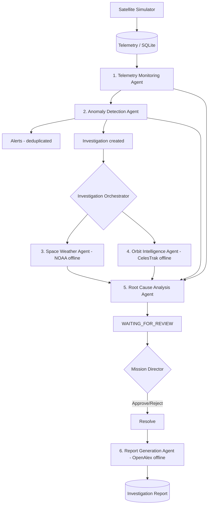

# PROJECT ORION
### Multi-Agent Satellite Intelligence & Anomaly Investigation Platform

> **Simulation / decision-support system.** Project ORION does **not** control, command, communicate with, or operate any real satellite. All satellites, telemetry, and external data are simulated or clearly-labelled **offline sample data**. Every recommendation is advisory and requires human review.

---

## 1. Problem statement

Satellite operators face a flood of telemetry. When something goes wrong, an operator must correlate many signals, pull in external context (space weather, orbital data), reason about the most likely cause, and decide what to do — quickly, and with an audit trail. Doing this manually is slow and error-prone.

## 2. Solution

Project ORION is an offline-first, end-to-end demonstration platform that:

1. **Simulates** a fleet of 5 satellites generating realistic telemetry.
2. Lets you **inject failures** (power, thermal, comms, orbit, battery).
3. **Detects anomalies** using configurable, persistence-based rules.
4. Raises **de-duplicated alerts** and automatically opens an **investigation**.
5. Runs a **6-agent pipeline** that gathers evidence, pulls offline space-weather & orbital context, and reaches an **explainable, deterministic root cause** with confidence, severity, and recommendations.
6. Requires a **human (Mission Director)** to approve/reject, then resolve.
7. Generates a printable **investigation report**.

Everything runs **fully offline** — no internet, no API keys, no external LLM.

## 3. Features

- Deterministic satellite simulator with progressive failure injection
- 5 configurable anomaly rules with persistence (anti-noise) and alert cooldown
- Automatic investigation creation + orchestration
- **Six specialized agents**, each recording a timed execution
- Deterministic weighted **Root Cause Analysis engine** (no LLM, fully explainable)
- Offline external-data adapters (NOAA SWPC, CelesTrak, OpenAlex) with provenance + fixture fallback
- Human-in-the-loop approve / reject / resolve with confirmation
- Printable reports with references and full data provenance
- Premium dark mission-control dashboard (React + Tailwind + Recharts)
- SQLite persistence via Node's built-in `node:sqlite` (zero native dependencies)

## 4. Architecture



**Style:** modular monolith — one Node/TypeScript backend, one React frontend, one embedded SQLite database, six agents, three offline adapters.

## 5. System workflow

`Simulator → Telemetry → Monitoring Agent → Anomaly Detection → Alerts → Investigation → Orchestrator → Space Weather + Orbit Agents → Root Cause Analysis → WAITING_FOR_REVIEW → Mission Director approve/reject → Resolve → Report Generation Agent → Report`

## 6. The six agents

| # | Agent | Input | Output |
|---|-------|-------|--------|
| 1 | **Telemetry Monitoring** | recent telemetry window + thresholds | `TelemetryObservation` (trends, health, violations) |
| 2 | **Anomaly Detection** | `TelemetryObservation` | `AnomalyDetectionResult` (classified anomalies + severity) |
| 3 | **Space Weather** | investigation context | `SpaceWeatherEvidence` (NOAA offline + provenance) |
| 4 | **Orbit Intelligence** | satellite + context | `OrbitEvidence` (CelesTrak offline + provenance) |
| 5 | **Root Cause Analysis** | all of the above bundled | `RootCauseAnalysisResult` (cause, confidence, severity, scoring, recommendations) |
| 6 | **Report Generation** | completed investigation | `InvestigationReport` (structured, printable, OpenAlex refs) |

Each agent extends `BaseAgent` and writes an `AgentExecution` row (status, timing, input/output summaries, errors). A single agent failure is recorded honestly and never crashes the app.

## 7. Technology stack

| Layer | Technology |
|-------|-----------|
| Frontend | React 18, TypeScript, Vite, Tailwind CSS, React Router, Recharts, Lucide |
| Backend | Node.js, TypeScript, Express, `tsx` |
| Database | SQLite via built-in `node:sqlite` (no native compilation) |
| Reasoning | Deterministic weighted scoring engine (no LLM, no API key) |
| Tests | Vitest (backend) |
| Real-time | Frontend polling (~2–3s); no WebSockets |

> **Note on the stack:** The project specification called for a Python/FastAPI backend. Python is not installed on the target company-managed laptop and installing a runtime is not permitted, so the backend was implemented in **Node.js + TypeScript** (which *is* available) preserving the identical architecture — 6 agents, orchestrator, deterministic RCA, SQLite, offline adapters, and the full REST surface — so the entire demo runs end-to-end on the laptop today.

## 8. Database tables

`satellites`, `telemetry`, `alerts`, `investigations`, `evidence`, `recommendations`, `agent_executions`, `reports`, `system_settings`. The SQLite file lives at `backend/data/orion.db` and is created + seeded automatically on first start.

## 9. REST API (all under `/api`)

Health · Dashboard (`summary`, `telemetry`, `recent-alerts`, `investigations`, `insights`, `space-weather`) · Satellites (`/`, `/:id`, `/:id/telemetry`) · Telemetry (`/`, `/latest`) · Alerts (`/`, `/:id`, `/:id/acknowledge`) · Investigations (`/`, `/:id`, `/:id/approve|reject|resolve|rerun-analysis|generate-report`, `/:id/agent-executions`) · Simulation Control Center (`/status`, `/satellites`, `/failures`, `/sessions` CRUD, `/sessions/:id/start|pause|resume|stop`, `/sessions/:id/config|speed`, `/sessions/:id/failures` +DELETE, `/sessions/:id/telemetry|events`) · Agents (`/`, `/executions`) · Integrations (`/status`) · Reports (`/`, `/:id`) · Settings (`/thresholds` GET/PUT, `/thresholds/reset`).

## 10. External adapters & offline strategy

Three adapters (NOAA SWPC, CelesTrak, OpenAlex) default to **OFFLINE_FIXTURE** mode, reading bundled JSON in `backend/src/integrations/fixtures/`. Optional live mode is disabled by default; if enabled and a call failed it would fall back to the fixture and set `fallback_used`. Every result carries provenance: `source_name`, `source_url`, `retrieved_at`, `mode`, `cached`, `fallback_used`. A simple in-memory TTL cache avoids repeated reads.

## 11. Root Cause Analysis engine

A hand-authored knowledge base maps anomalies → candidate root causes with numeric weights (e.g. `ABNORMAL_POWER_CONSUMPTION → +0.45 PAYLOAD_POWER_SUBSYSTEM_MALFUNCTION`). Space-weather and orbit context adjust scores up or down. Scores are normalized; the highest wins. **Confidence** is derived deterministically from the winner's dominance and its margin over the runner-up, bounded to a realistic 50–97%. Same evidence ⇒ same conclusion, every time — and the full scoring breakdown is shown in the UI and report.

---

## 12. Prerequisites

- **Node.js ≥ 22.5** (uses the built-in `node:sqlite`). Verified with Node v25.
- npm (bundled with Node).
- No Python, Docker, Postgres, Redis, Ollama, or internet required.

## 13. Install (project-local only — no admin, no system changes)

```bash
# from the project root
cd backend  && npm install
cd ../frontend && npm install
```

## 14. Run

Open **two terminals**.

**Terminal 1 — backend** (binds 127.0.0.1:8000 only):
```bash
cd backend
npm start
```

**Terminal 2 — frontend** (binds 127.0.0.1:5173 only, proxies /api to the backend):
```bash
cd frontend
npm run dev
```

Then open **http://127.0.0.1:5173** in a browser.

- Backend API docs / info: http://127.0.0.1:8000/
- Health: http://127.0.0.1:8000/api/health

## 15. Simulation Control Center walkthrough (offline)

The **Simulation Control Center** (`/simulation`) is a general-purpose, human-driven
simulation environment — **no demo launcher, no scenarios, no destructive reset**.
See `docs/SATELLITE_SIMULATION_CONTROL_CENTER.md`.

1. Open the dashboard → satellites listed.
2. Go to **Simulation** → **Select Satellite** (any active, sim-eligible satellite,
   including manually onboarded ones like `SAT-NEW-001`).
3. Optionally configure telemetry (baseline/min/max/noise/drift), then **Start**.
4. Open the **Failure Catalog** → pick e.g. `POWER_SYSTEM_FAILURE` (severity/onset/
   recovery/duration) → **Inject failure**. Watch battery fall and power climb.
5. `LOW_BATTERY` + `ABNORMAL_POWER_CONSUMPTION` anomalies → alerts → an investigation opens automatically and runs all 6 agents.
6. Open **Investigations → the ORION-3 investigation**: see the agent timeline, evidence (with OFFLINE FIXTURE provenance), root cause **PAYLOAD_POWER_SUBSYSTEM_MALFUNCTION** (~80%, CRITICAL), scoring breakdown, and recommendations.
7. Click **Approve** → confirm → **Resolve Investigation** → **Generate Report**.
8. Open the report and **Print / Save PDF**.

See **EVALUATION_DEMO.md** for a click-by-click script with expected values, and **PROJECT_NOTES.md** for a from-scratch explanation and 50+ evaluator Q&A.

## 16. Testing

```bash
cd backend
npm test        # Vitest: 22 tests (anomaly rules, RCA determinism, offline adapters, full demo flow)
npx tsc --noEmit  # backend typecheck

cd ../frontend
npm run typecheck  # frontend typecheck
npm run build      # production build
```

## 17. Limitations

- Simulation and decision-support only; no real spacecraft interface.
- Live API mode is intentionally disabled; adapters use offline fixtures.
- No authentication (single-user local demo).
- RCA is a deterministic rule/scoring engine, not machine learning.

## 18. Future enhancements

- Optional live NOAA/CelesTrak/OpenAlex mode behind an explicit network toggle.
- Historical trend analytics and multi-satellite correlation.
- Role-based access and audit export.
- Code-splitting the frontend bundle.

## 19. Safety statement

Project ORION is a **simulation and decision-support platform**. It does not control, command, communicate with, or operate real satellites. External data shown is offline sample data. All recommendations are advisory and require Mission Director review.

## Dynamic Satellite Onboarding

Satellites are no longer limited to the seeded demo fleet. Authorized users
(Director/Admin) can **register new satellites at runtime** via the Satellites page
("Add satellite") or `POST /api/satellites`. A manually-registered satellite is a
first-class persisted entity that flows through every module — dashboard, search,
details, orbit, telemetry, simulation, alerts, anomaly detection, investigations,
the six-agent pipeline, deterministic RCA, lifecycle, reports, Copilot, AI Assistant,
Planner, Critic, and observability — with **no fabricated data**: it begins with no
telemetry/alerts/investigations and honest "unavailable" states, gaining capabilities
only as it receives real or explicitly-simulated telemetry. See
`docs/DYNAMIC_SATELLITE_ONBOARDING.md`, `docs/DYNAMIC_SATELLITE_INTEGRATION_AUDIT.md`,
and `docs/DYNAMIC_SATELLITE_E2E_VERIFICATION.md`. AI systems remain read-only w.r.t.
satellites — creation/edit/archive/reactivate/simulation are explicit human actions.

### Manual Satellite Status Control

Authorized users (Director/Admin) can set a **persistent manual status override**
on any registered satellite — `AUTO`, `HEALTHY`, `WARNING`, or `ALERT` — from the
Satellite Details → *Manage status* control or `PATCH /api/satellites/:id/status`.
`AUTO` uses the telemetry/anomaly/mission-derived status; `HEALTHY/WARNING/ALERT`
apply an operator override. A single canonical resolver
(`backend/src/services/satelliteStatus.ts`) computes `effectiveStatus = MANUAL
override ?? derivedStatus`, and every read surface (list, detail, dashboard fleet
counts + system health, orbit, search, AI `getSatellite`/status answers) reflects
the **effective** status through that one path — the derived status is never
overwritten. An override is a display/operational signal only: it **never** creates
telemetry, alerts, investigations, RCA, or evidence, and the AI cannot set it. Every
change is recorded in an immutable `satellite_status_events` audit trail (viewable
per satellite). See `docs/MANUAL_SATELLITE_STATUS_AUDIT.md`.

### Interactive 3D Earth (Orbit & Trajectory + Dashboard)

The Orbit & Trajectory page and the Dashboard "Live Orbit Map" render a genuine
**WebGL 3D Earth** (three.js + @react-three/fiber + @react-three/drei) — realistic
NASA Blue Marble day/night textures, atmosphere glow, star field, 360° drag
rotation, zoom, auto-rotate, reset view, and fullscreen. Satellites are loaded
**dynamically** from the backend (no hardcoded fleet); markers use
`effectiveStatus` colors (green/amber/red) and manual overrides propagate to the
globe. Positions use the real sub-satellite point when telemetry lat/lon exist
(`LAT_LON_ALT`), otherwise a **deterministic, id-seeded visualization** placement
(never random, never labeled as telemetry — the mode is shown in the tooltip).
One shared renderer (`components/orbit3d/`) powers both surfaces (full mode vs
compact). Earth textures are local, public-domain NASA imagery (see
`public/assets/earth/LICENSE.md`); no runtime external fetch, no API keys. See
`docs/INTERACTIVE_3D_EARTH_AUDIT.md`.

### ORION AI Assistant — query understanding & correctness

The AI Assistant understands each question before acting: intent classification →
entity extraction → **entity resolution** → route planning → conditional retrieval →
**relevance filtering** → synthesis → grounding + answer↔question alignment. Greetings,
thanks, capabilities, out-of-scope and unknown input are answered directly with **no
retrieval**; a non-existent satellite id resolves to NOT_FOUND (no document lookup);
structured questions (telemetry/alerts/investigations/RCA/evidence/reports) use
read-only tools first; mission-knowledge retrieval is relevance-gated (identifier-aware)
and abstains when nothing is relevant — never dumping raw chunks. See the
`docs/AI_ASSISTANT_*` documents.
